# Koentjoro Platform - Entity Relationship Diagram (ERD)

## Database Schema Design

### Core Entities

```mermaid
erDiagram
    User ||--o{ Offer : creates
    User ||--o{ Message : sends
    User ||--o{ Notification : receives
    User ||--o{ Document : uploads
    User {
        uuid id PK
        string email UK
        string password_digest
        string full_name
        string role "owner, company_representative"
        string company_name "nullable, required if company"
        string company_website "nullable"
        string company_description "nullable"
        string company_size "nullable"
        string company_industry "nullable"
        string position_title "nullable, for company reps"
        string phone "nullable"
        string avatar_url "nullable"
        boolean email_verified
        string verification_token "nullable"
        timestamp verified_at "nullable"
        timestamp last_sign_in_at "nullable"
        jsonb preferences "notification settings, etc"
        timestamp created_at
        timestamp updated_at
    }

    Offer ||--o{ Message : contains
    Offer ||--o{ OfferHistory : tracks
    Offer ||--o{ Notification : triggers
    Offer {
        uuid id PK
        uuid company_user_id FK
        string position_title
        string work_site "remote, hybrid, onsite"
        string employment_type "full-time, contract, freelance"
        decimal salary_amount
        string salary_currency "default: USD"
        string salary_period "yearly, monthly, hourly"
        text benefits "jsonb array of benefits"
        text message "company message to owner"
        string status "pending, accepted, rejected, negotiating, withdrawn"
        integer rank "calculated ranking"
        decimal score "calculated score for ranking"
        timestamp expires_at "nullable"
        timestamp responded_at "nullable"
        text rejection_reason "nullable"
        text negotiation_notes "nullable"
        timestamp created_at
        timestamp updated_at
    }

    Message {
        uuid id PK
        uuid offer_id FK
        uuid sender_id FK
        uuid recipient_id FK
        text content
        string message_type "text, system, negotiation"
        boolean is_read
        timestamp read_at "nullable"
        jsonb attachments "nullable"
        timestamp created_at
        timestamp updated_at
    }

    OfferHistory {
        uuid id PK
        uuid offer_id FK
        uuid changed_by_user_id FK
        string action "created, status_changed, updated, withdrawn"
        string old_status "nullable"
        string new_status "nullable"
        jsonb changes "track what changed"
        text notes "nullable"
        timestamp created_at
    }

    Notification {
        uuid id PK
        uuid user_id FK
        uuid offer_id FK "nullable"
        string notification_type "new_offer, status_change, new_message, system"
        string title
        text content
        boolean is_read
        timestamp read_at "nullable"
        jsonb metadata "additional data"
        timestamp created_at
        timestamp updated_at
    }

    Document {
        uuid id PK
        uuid user_id FK
        string document_type "cv, resume, cover_letter, portfolio, other"
        string file_name
        string file_url
        string file_type "pdf, docx, etc"
        integer file_size
        string language "en, ja, etc"
        boolean is_public
        integer download_count
        timestamp created_at
        timestamp updated_at
    }

    Profile {
        uuid id PK
        uuid user_id FK "one-to-one with User"
        text bio "nullable"
        string tagline "nullable"
        string location "nullable"
        jsonb education "array of education entries"
        jsonb experience "array of work experience"
        jsonb skills "array of skills with proficiency"
        jsonb languages "array of languages with proficiency"
        jsonb certifications "array of certifications"
        jsonb achievements "array of achievements"
        jsonb social_links "github, linkedin, twitter, etc"
        string availability_status "available, not_available, open_to_offers"
        timestamp created_at
        timestamp updated_at
    }

    User ||--|| Profile : has

    Testimonial {
        uuid id PK
        string author_name
        string author_title
        string author_company
        string author_photo_url "nullable"
        text content
        integer rating "1-5"
        string testimonial_type "client, colleague, judge, other"
        boolean is_featured
        boolean is_published
        integer display_order
        timestamp created_at
        timestamp updated_at
    }

    BlogPost {
        uuid id PK
        uuid author_id FK "references User"
        string title
        string slug UK
        text excerpt
        text content
        string featured_image_url "nullable"
        jsonb tags "array of tags"
        string status "draft, published, archived"
        integer view_count
        timestamp published_at "nullable"
        timestamp created_at
        timestamp updated_at
    }

    User ||--o{ BlogPost : writes

    FAQ {
        uuid id PK
        string question
        text answer
        string category "general, bidding, technical, account, other"
        integer display_order
        boolean is_published
        integer view_count
        timestamp created_at
        timestamp updated_at
    }

    ContactSubmission {
        uuid id PK
        string name
        string email
        text message
        string contact_type "general, support, business, other"
        string status "new, read, responded, archived"
        text response "nullable"
        timestamp responded_at "nullable"
        string ip_address "nullable"
        timestamp created_at
        timestamp updated_at
    }

    Analytics {
        uuid id PK
        uuid user_id FK "nullable, for user-specific stats"
        string event_type "page_view, offer_submitted, offer_accepted, etc"
        string page_path "nullable"
        jsonb event_data "flexible data storage"
        string user_agent "nullable"
        string ip_address "nullable"
        timestamp created_at
    }

    User ||--o{ Analytics : generates

    OfferMetrics {
        uuid id PK
        date metric_date
        integer total_offers
        integer pending_offers
        integer accepted_offers
        integer rejected_offers
        integer negotiating_offers
        decimal average_salary
        decimal highest_salary
        decimal lowest_salary
        jsonb top_positions "array of most common positions"
        jsonb top_companies "array of companies"
        timestamp created_at
    }
```



## Indexes for Performance

```sql
-- Users Table
CREATE INDEX idx_users_email ON users(email);
CREATE INDEX idx_users_role ON users(role);
CREATE INDEX idx_users_created_at ON users(created_at);

-- Offers Table
CREATE INDEX idx_offers_company_user_id ON offers(company_user_id);
CREATE INDEX idx_offers_status ON offers(status);
CREATE INDEX idx_offers_rank ON offers(rank);
CREATE INDEX idx_offers_created_at ON offers(created_at);
CREATE INDEX idx_offers_status_rank ON offers(status, rank);

-- Messages Table
CREATE INDEX idx_messages_offer_id ON messages(offer_id);
CREATE INDEX idx_messages_sender_id ON messages(sender_id);
CREATE INDEX idx_messages_recipient_id ON messages(recipient_id);
CREATE INDEX idx_messages_is_read ON messages(is_read);
CREATE INDEX idx_messages_created_at ON messages(created_at);

-- Notifications Table
CREATE INDEX idx_notifications_user_id ON notifications(user_id);
CREATE INDEX idx_notifications_is_read ON notifications(is_read);
CREATE INDEX idx_notifications_created_at ON notifications(created_at);

-- Blog Posts
CREATE INDEX idx_blog_posts_slug ON blog_posts(slug);
CREATE INDEX idx_blog_posts_status ON blog_posts(status);
CREATE INDEX idx_blog_posts_published_at ON blog_posts(published_at);

-- Analytics
CREATE INDEX idx_analytics_event_type ON analytics(event_type);
CREATE INDEX idx_analytics_created_at ON analytics(created_at);
CREATE INDEX idx_analytics_user_id_created_at ON analytics(user_id, created_at);
```

## Key Relationships

### 1. User Relationships

- **One-to-Many**: User → Offers (company users create multiple offers)
- **One-to-Many**: User → Messages (users send many messages)
- **One-to-Many**: User → Notifications (users receive many notifications)
- **One-to-One**: User → Profile (each user has one profile)
- **One-to-Many**: User → Documents (users upload multiple documents)
- **One-to-Many**: User → BlogPosts (owner writes blog posts)

### 2. Offer Relationships

- **Many-to-One**: Offer → User (many offers belong to one company user)
- **One-to-Many**: Offer → Messages (one offer has many messages/conversations)
- **One-to-Many**: Offer → OfferHistory (one offer has many status changes)
- **One-to-Many**: Offer → Notifications (one offer triggers many notifications)

### 3. Message Relationships

- **Many-to-One**: Message → Offer (messages belong to an offer thread)
- **Many-to-One**: Message → User (sender)
- **Many-to-One**: Message → User (recipient)

## Business Logic Notes

### Offer Ranking Algorithm

```
rank = RANK() OVER (
  PARTITION BY status
  ORDER BY
    salary_amount DESC,
    created_at ASC
)

score = (
  (salary_amount / max_salary) * 0.5 +
  (benefits_count / max_benefits) * 0.2 +
  (1 - (EXTRACT(EPOCH FROM (NOW() - created_at)) / max_time_difference)) * 0.2 +
  (company_reputation_score) * 0.1
)
```

### Status Transitions

```
pending → accepted ✓
pending → rejected ✓
pending → negotiating ✓
pending → withdrawn ✓

negotiating → accepted ✓
negotiating → rejected ✓
negotiating → withdrawn ✓

accepted → [final state]
rejected → [final state]
withdrawn → [final state]
```

### User Roles & Permissions

**Owner (Fajrul)**

- View all offers
- Accept/Reject/Negotiate offers
- Send messages to companies
- Manage profile
- Publish blog posts
- View analytics dashboard

**Company Representative**

- Create offers
- View own offers
- Edit pending/negotiating offers
- Withdraw offers
- Send messages to owner
- View leaderboard (limited)

**Visitor (Not Authenticated)**

- View public profile
- View public blog posts
- Submit contact form
- View FAQ

## Data Validation Rules

### User

- Email: Required, unique, valid format
- Password: Min 8 chars, must have uppercase, lowercase, number
- Role: Must be 'owner' or 'company_representative'
- Company fields: Required if role is 'company_representative'

### Offer

- Salary: Must be positive number
- Status: Must be valid enum value
- Work site: Must be 'remote', 'hybrid', or 'onsite'
- Employment type: Must be 'full-time', 'contract', or 'freelance'
- Expires at: Must be future date (if set)

### Message

- Content: Required, max 5000 chars
- Must belong to an offer
- Sender must be part of the offer (company user or owner)

## GraphQL Schema Considerations

### Main Queries

```graphql
# Users
me: User
user(id: ID!): User

# Offers
offers(status: OfferStatus, limit: Int, offset: Int): [Offer!]!
offer(id: ID!): Offer
myOffers(status: OfferStatus): [Offer!]!
offerLeaderboard(limit: Int): [Offer!]!

# Messages
messages(offerId: ID!): [Message!]!
unreadMessageCount: Int!

# Notifications
notifications(limit: Int, unreadOnly: Boolean): [Notification!]!
unreadNotificationCount: Int!

# Content
blogPosts(status: String, limit: Int): [BlogPost!]!
blogPost(slug: String!): BlogPost
faqs(category: String): [FAQ!]!
testimonials(featured: Boolean): [Testimonial!]!

# Analytics (Owner only)
offerMetrics(startDate: Date, endDate: Date): OfferMetrics
```

### Main Mutations

```graphql
# Auth
signUp(input: SignUpInput!): AuthPayload!
signIn(input: SignInInput!): AuthPayload!
signOut: Boolean!
forgotPassword(email: String!): Boolean!
resetPassword(input: ResetPasswordInput!): Boolean!

# Offers
createOffer(input: CreateOfferInput!): Offer!
updateOffer(id: ID!, input: UpdateOfferInput!): Offer!
withdrawOffer(id: ID!): Offer!
respondToOffer(id: ID!, input: RespondToOfferInput!): Offer!

# Messages
sendMessage(input: SendMessageInput!): Message!
markMessageAsRead(id: ID!): Message!

# Profile
updateProfile(input: UpdateProfileInput!): Profile!

# Documents
uploadDocument(input: UploadDocumentInput!): Document!
deleteDocument(id: ID!): Boolean!

# Notifications
markNotificationAsRead(id: ID!): Notification!
markAllNotificationsAsRead: Boolean!

# Contact
submitContactForm(input: ContactInput!): ContactSubmission!
```

### Subscriptions

```graphql
# Real-time updates
newMessage(offerId: ID!): Message!
offerStatusChanged(offerId: ID!): Offer!
newNotification: Notification!
```

## Storage Requirements

### Active Storage (Rails)

- **CV/Resume files**: PDF, DOCX (max 5MB)
- **Profile photos**: JPG, PNG (max 2MB)
- **Company logos**: JPG, PNG (max 1MB)
- **Blog post images**: JPG, PNG (max 5MB)

### File Storage Strategy

- **Development**: Local disk
- **Production**: AWS S3 or Google Cloud Storage
- **CDN**: CloudFlare for static assets

## Security Considerations

1. **Authentication**: JWT tokens with refresh mechanism
2. **Authorization**: Role-based access control (RBAC)
3. **Data Privacy**:
   - Offers visible only to owner and creating company
   - Messages encrypted in transit (HTTPS)
   - Personal data anonymized in analytics
4. **Rate Limiting**:
   - API calls: 100 requests/minute per user
   - Offer submissions: 5 offers/day per company
   - Contact form: 3 submissions/hour per IP
5. **Input Validation**: All inputs sanitized and validated
6. **SQL Injection**: Use parameterized queries (ActiveRecord)
7. **XSS Protection**: Sanitize user-generated content

## Backup & Recovery

- **Database backups**: Daily automated backups
- **File backups**: Separate backup for uploaded files
- **Retention**: 30 days for daily, 12 months for monthly
- **Recovery Time Objective (RTO)**: < 4 hours
- **Recovery Point Objective (RPO)**: < 24 hours

---

## Database Size Estimates (Year 1)

- **Users**: ~500 records (250 companies) = ~500 KB
- **Offers**: ~2,000 records = ~5 MB
- **Messages**: ~10,000 records = ~50 MB
- **Notifications**: ~20,000 records = ~20 MB
- **Analytics**: ~100,000 events = ~500 MB
- **Documents**: ~200 files = ~500 MB
- **Total**: ~1.5 GB (conservative estimate)

## Scalability Considerations

1. **Database**: PostgreSQL with read replicas for scaling reads
2. **Caching**: Redis for session storage, query caching
3. **Queue**: Sidekiq for background jobs (emails, notifications)
4. **WebSockets**: Action Cable with Redis adapter for pub/sub
5. **Search**: PostgreSQL full-text search initially, Elasticsearch if needed
6. **Monitoring**: Application performance monitoring (APM) tools
